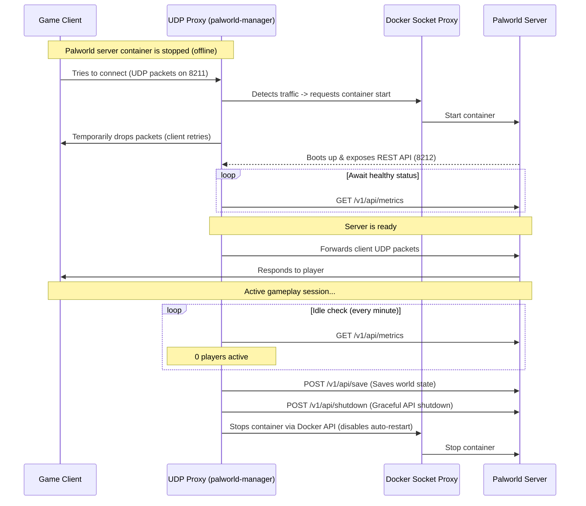

# Palworld On-Demand Manager (palworld-auto-shutdown)

[](https://github.com/NicoSky13/palworld-auto-shutdown/actions/workflows/ci.yml)
[](https://opensource.org/licenses/MIT)

An ultra-lightweight Go utility designed to intelligently manage the power lifecycle of a Palworld dedicated server under Docker. It is perfect for home NAS servers (ZimaCube, Synology, Unraid, TrueNAS) to save RAM and CPU resources by only running the game server when players are active.

> [!NOTE]
> 🔮 **Vibe Coded Project**: This utility was vibe coded. Contributions, suggestions, and Pull Requests are highly welcomed!

---

## Features

- ⚡ **Wake-on-Demand (UDP Proxy):** Listens on the public game port `8211/UDP`. When a client attempts to join, it intercepts the initial UDP traffic and instantly starts the server container.
- 💤 **Auto-Sleep (Idle Monitor):** Periodically polls the server's official REST API. If the server is empty (0 players) for a configured timeout, it runs a world save and gracefully shuts down the container.
- 🔒 **Secure Docker Integration:** Configured to run alongside `docker-socket-proxy` to prevent exposing the root Docker socket to the manager container.
- 🎨 **Modern Admin Dashboard:** Includes a responsive web interface (which can be disabled) to check the server state, active player count, trigger manual saves, start/stop the server, and read live logs.
- 🌍 **Internationalization (i18n):** The web dashboard automatically translates to French or English based on the browser's language.

---

## How It Works



---

## Configuration

The manager is configured using environment variables:

| Variable | Description | Default Value |
| :--- | :--- | :--- |
| `CONTAINER_NAME` | The target Palworld container name to manage. | `palworld-server` |
| `PALWORLD_API_URL` | The internal REST API URL of the Palworld server. | `http://palworld-server:8212` |
| `PALWORLD_API_PASSWORD` | The admin password (`AdminPassword` in Palworld settings) required for API calls. | *Required* |
| `PALWORLD_INTERNAL_ADDR` | The internal UDP address of the Palworld server container. | `palworld-server:8211` |
| `LISTEN_ADDR` | The public address the UDP proxy will listen on. | `0.0.0.0:8211` |
| `IDLE_TIMEOUT_MINUTES` | Period of inactivity (in minutes) before automatic shutdown. | `15` |
| `CHECK_INTERVAL_SECONDS` | Interval (in seconds) between health checks. | `60` |
| `ENABLE_WEB_UI` | Whether to enable (`true`) or disable (`false`) the web admin panel. | `true` |
| `WEB_PORT` | The port the web interface will listen on. | `8213` |
| `WEB_USER` | Basic Auth username (leave empty to disable authentication). | `admin` |
| `WEB_PASSWORD` | Basic Auth password (leave empty to disable authentication). | `admin` |

---

## Deployment (Docker Compose)

Create a `docker-compose.yml` file to deploy both services along with the security socket proxy:

```yaml
version: '3.8'

services:
  # Security proxy for the Docker socket.
  # Prevents palworld-manager from having direct root access on the host.
  docker-socket-proxy:
    image: tecnativa/docker-socket-proxy:latest
    container_name: docker-socket-proxy
    restart: unless-stopped
    volumes:
      - /var/run/docker.sock:/var/run/docker.sock:ro # Read-only access to the host docker socket
    environment:
      - CONTAINERS=1 # Allow container inspection, start, and stop operations only
    networks:
      - palworld-net

  palworld-server:
    image: thijsvanloef/palworld-server-docker:latest
    container_name: palworld-server
    restart: "no"
    environment:
      - PORT=8211
      - PLAYERS=16
      - MULTIPLAY_REST_API_ENABLED=true
      - MULTIPLAY_REST_API_PORT=8212
      - ADMIN_PASSWORD=your_admin_password
      - COMMUNITY=false
    volumes:
      - ./palworld-data:/palworld/
    expose:
      - "8211/udp"
      - "8212/tcp"
    networks:
      - palworld-net

  palworld-manager:
    image: ghcr.io/nicosky13/palworld-auto-shutdown:latest
    container_name: palworld-manager
    restart: always
    ports:
      - "8211:8211/udp" # UDP Proxy listening publicly
      - "8213:8213/tcp" # Web admin panel
    environment:
      - DOCKER_HOST=tcp://docker-socket-proxy:2375 # Communicate via proxy
      - CONTAINER_NAME=palworld-server
      - PALWORLD_API_URL=http://palworld-server:8212
      - PALWORLD_API_PASSWORD=your_admin_password
      - PALWORLD_INTERNAL_ADDR=palworld-server:8211
      - IDLE_TIMEOUT_MINUTES=15
      - CHECK_INTERVAL_SECONDS=60
      - ENABLE_WEB_UI=true
      - WEB_PORT=8213
      - WEB_USER=admin
      - WEB_PASSWORD=a_secure_web_password
    networks:
      - palworld-net
    depends_on:
      - docker-socket-proxy
      - palworld-server

networks:
  palworld-net:
    driver: bridge
```

Start the stack:
```bash
docker compose up -d
```

---

## Contributing

### Development Hook Setup

This project uses a git pre-commit hook to automatically format Go code before committing. To enable it, run:
```bash
git config core.hooksPath .githooks
chmod +x .githooks/pre-commit
```

### Steps to contribute

1. Fork the repository.
2. Create a new branch (`git checkout -b feature/amazing-feature`).
3. Commit your changes (`git commit -m 'Add amazing feature'`).
4. Push to the branch (`git push origin feature/amazing-feature`).
5. Open a Pull Request.

---

## License

This project is licensed under the MIT License - see the [LICENSE](LICENSE) file for details.
